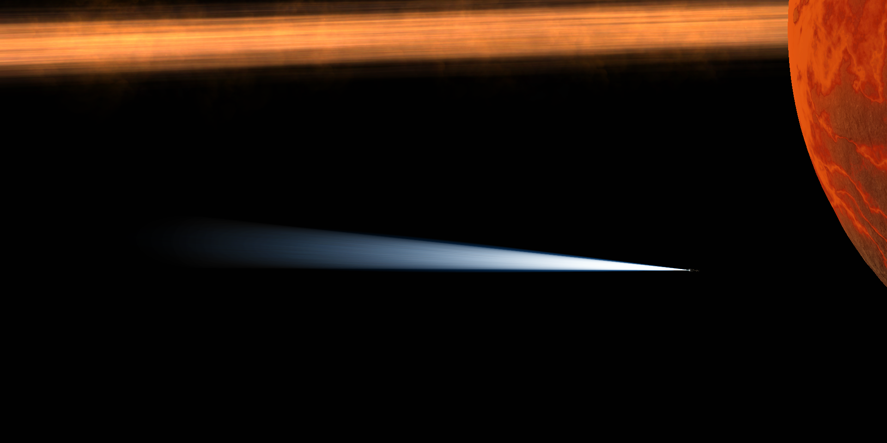
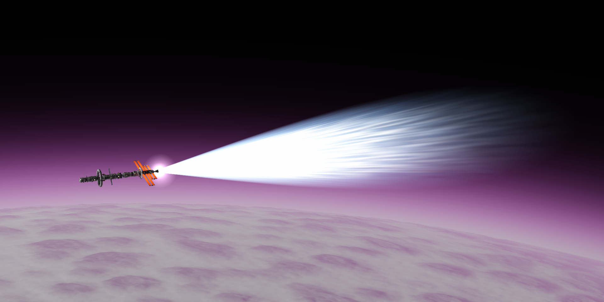
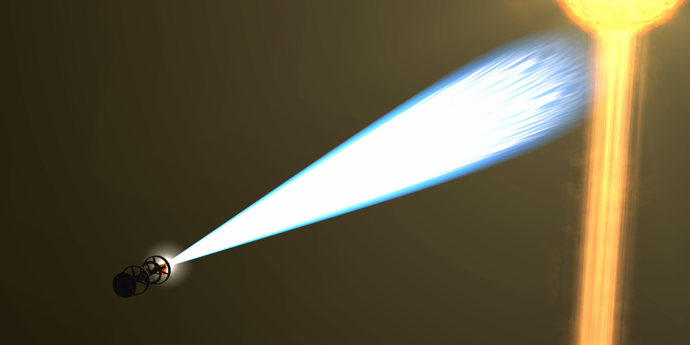
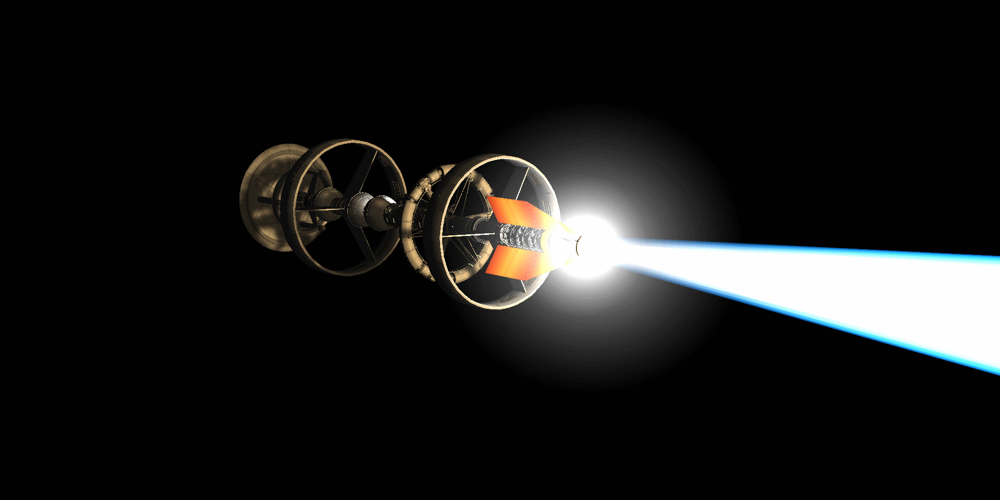

# Overkill Plumes

Switchable Waterfall configs for some rocket engines that aim for stylistic and somewhat hard-sci-fi-accurate exhaust plumes. Mainly just ModuleManager patches and homemade Waterfall templates.



## Dependencies

These mods are **required** for Overkill Plumes to run properly! You'll need to install each one (and their own dependencies) before installing this mod in order for it to work.

- [Stock Waterfall Effects](https://github.com/KnightofStJohn/StockWaterfallEffects)
  - Plumes use the [Waterfall](https://github.com/KSPModStewards/Waterfall) framework itself to render engine effects. SWE also comes with [ModuleManager](https://github.com/sarbian/ModuleManager) and [B9PartSwitch](https://github.com/blowfishpro/B9PartSwitch) as dependencies, which Overkill also uses. 

## Compatibilities
These mods are **not required** for Overkill to run, but are currently supported through patches. Effectively, these are mods whose engines can also get Overkill plumes. 

- [Far Future Technologies](https://github.com/post-kerbin-mining-corporation/FarFutureTechnologies)
  - X-2 'Heinlein' Nuclear Salt Water Rocket Engine
  - x-42 'Niven' Nuclear Salt Water Rocket Engine

- Stock
  - LV-N 'Nerv' Atomic Rocket Motor
  - Kerbodyne KR-2L+ 'Rhino' Liquid Fuel Engine





## Installation

### via CKAN
Search for "Overkill Plumes" in your CKAN client and install the mod as usual. CKAN will also flag any dependencies and install those as well.

### via SpaceDock/GitHub
Download the latest ZIP from [SpaceDock](https://spacedock.info/mod/4447/Overkill%20Plumes) (or [the GitHub repo's Releases page](https://github.com/QuantumsHevy/OverkillPlumes/releases)), extract it, and drag ONLY the `OverkillPlumes` folder inside your KSP installation's `GameData` folder.

When done correctly, the path should look like this:
```
KerbalSpaceProgram/
└── GameData/
    ├── OverkillPlumes/
    │   ├── FX/
    │   ├── Patches/
    │   └── ...
    ├── Squad/
    ├── YourOtherMods/
    └── ...
```

## Known Issues

- Overkill plumes don't react to atmosphere depth and only ever display vaccum-accurate plumes. This is intentional for the first releases, and atmosphere-accurate plumes will be added to all supported engines in a future update.
<!--
- KerbalAtomics compatibility is not currently supported. Separately, installing KerbalAtomics together with ReStock has been observed to cause the stock Nerv's LF mode to have no sound or visible plume despite functioning thrust. **This is a conflict between those two mods' own patches and is outside of Overkill's scope to fix.**
-->

## Credits

- **[Quantums Hevy](https://github.com/QuantumsHevy)**, original mod author



## License

Copyright © 2026 Quantums Hevy

This work is licensed under the [GNU General Public License v3.0.](./COPYING) (GPL-3.0). 

This project contains patches and configuration files intended for use with other third-party mods. No ownership of those other projects or their assets is claimed, and nothing in this repository alters or supersedes their respective licenses.
