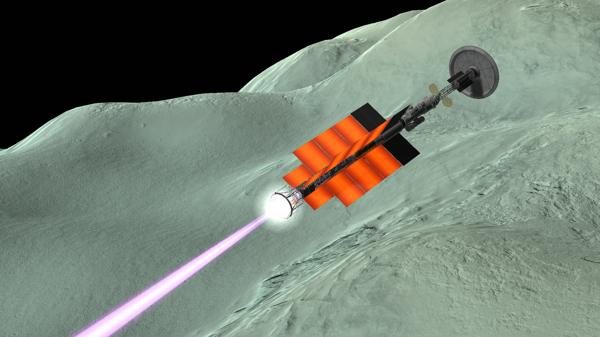
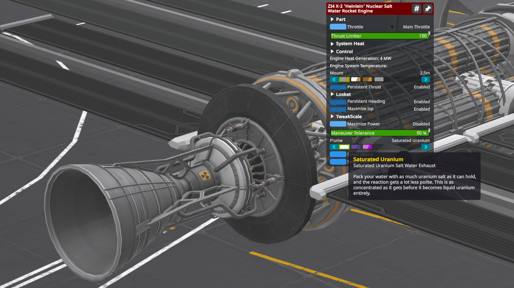
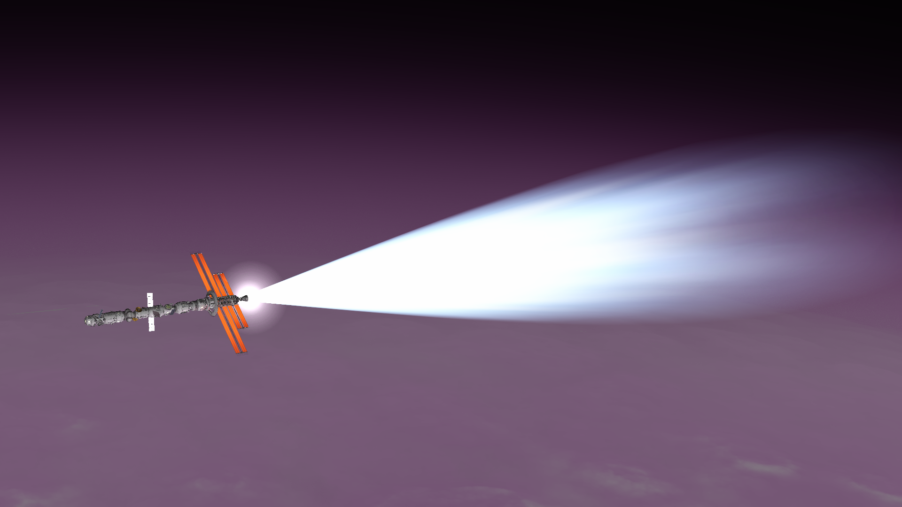
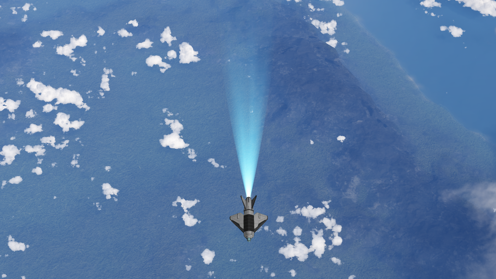

# Overkill Plumes

> "To be the first to enter the cosmos. To engage, single-handed, in an unprecedented duel with nature. Could one dream of anything more?" — Yuri Gagarin, *Road to the Stars (1961)*

Switchable configurations for some Kerbal Space Program engines that aim to add stylistic and somewhat hard-sci-fi-accurate exhaust plumes. Mainly just ModuleManager patches and homemade Waterfall templates.



## Dependencies
Overkill requires these mods in order to run as intended.

- [ModuleManager](https://github.com/sarbian/ModuleManager)
- [Waterfall](https://github.com/KSPModStewards/Waterfall)
- [B9PartSwitch](https://github.com/blowfishpro/B9PartSwitch)

## Compatibilities
Patches that add compatibility with these mods are included with installation. Effectively, these are mods whose engines can get Overkill plumes. 

- [Far Future Technologies](https://github.com/post-kerbin-mining-corporation/FarFutureTechnologies)
  - X-2 'Heinlein' Nuclear Salt Water Rocket Engine
  - X-42 'Niven' Nuclear Salt Water Rocket Engine
  - A-834M 'Frisbee' Antimatter Torch Engine (Compatible with [Interstellar Plumes](https://spacedock.info/mod/4110/Interstellar%20Plumes))
- [Sterling Systems](https://github.com/JadeOfMaar/SterlingSystems)
  - Sterling IPE-GC 'Slim'
  - Sterling IPE-GC 'Tiny'
  - Sterling ISME-BC 'Immolator' (Compatible with [Interstellar Plumes](https://spacedock.info/mod/4110/Interstellar%20Plumes))
- [Stock Waterfall Effects](https://github.com/KnightofStJohn/StockWaterfallEffects) (Compatible with [Restock](https://github.com/PorktoberRevolution/ReStocked))
  - LV-N 'Nerv' Atomic Rocket Motor
  - Kerbodyne KR-2L+ 'Rhino' Liquid Fuel Engine
  - T-1 Toroidal Aerospike 'Dart' Liquid Fuel Engine
  - Mk-55 'Thud' Liquid Fuel Engine

Every supported engine gets a plume switcher in their right-click menus to return effects to their original looks. Most switchers also offer a faux-antimatter option for that additional aesthetic kick.





## Installation
This mod is available to install via CKAN as of September 5th, 2026.

Download the latest ZIP from [SpaceDock](https://spacedock.info/mod/4447/Overkill%20Plumes) and extract the folder directly into your installation's `GameData` folder using File Explorer's "Extract all" option.

You may also extract the folder manually and place ONLY the parent `OverkillPlumes` folder inside `GameData`.

<!--
When done correctly, the path to the mod should look like this:
```
KerbalSpaceProgram/
└── GameData/
    ├── OverkillPlumes/
    │   ├── Flags/
    │   ├── FX/
    │   └── ...
    ├── Squad/
    ├── YourOtherMods/
    └── ...
```
-->

## Known Issues
- Overkill plumes don't react to atmosphere depth and only display vacuum-accurate plumes. This is intentional for the first few releases, and atmosphere-accurate plumes will be added to all supported engines over the span of future updates.

- [KerbalAtomics](https://github.com/post-kerbin-mining-corporation/KerbalAtomics) compatibility: The plume switcher (including the faux-antimatter option) only works correctly when the Nerv is in LH2 mode. Selecting the LF mode makes it fall back to KerbalAtomics' own particle effects with no Waterfall effects at all. If Restock is installed on top of this, the engine loses its effects entirely when in LF mode. This is a conflict between KerbalAtomics and Stock Waterfall Effects/Restock, and is currently outside of Overkill's scope to handle.

## Credits
- **[Quantums Hevy](https://github.com/QuantumsHevy)**, original mod author



## License
Copyright © 2026 Quantums Hevy

This work is licensed under the [GNU General Public License v3.0.](./COPYING) (GPL-3.0). 

This project contains configuration files intended for use with other third-party Kerbal Space Program mods. No ownership of those other projects or their assets is claimed by Overkill Plumes, and nothing in this repository alters or supersedes their respective or associated licenses.
